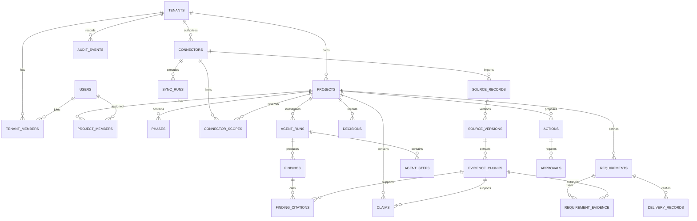

# AtlasAI Finalized Entity Relationship Design — PostgreSQL

## 1. ERD design decisions

- PostgreSQL is the system of record for metadata, relationships, permissions, workflow state, and audit.
- Object storage holds original files and large artifacts.
- UUIDs are used for internal primary keys.
- All timestamps use `timestamptz` and are stored in UTC.
- `jsonb` is reserved for provider-specific metadata, flexible payloads, and structured output.
- Original source versions are immutable.
- Soft deletion is used for source-derived content where retention policy requires tombstoning.
- Foreign keys must have explicit delete behavior.
- Every tenant/project-scoped table must support authorization filtering.
- Migrations are mandatory; tables must not be auto-created in production.

## 2. Required PostgreSQL extensions

```sql
CREATE EXTENSION IF NOT EXISTS pgcrypto;
CREATE EXTENSION IF NOT EXISTS citext;
CREATE EXTENSION IF NOT EXISTS vector;
```

## 3. Final table catalogue

### tenants

Purpose: company/workspace boundary.

Columns:

- `id uuid primary key default gen_random_uuid()`
- `name varchar(200) not null`
- `slug varchar(100) not null unique`
- `status varchar(30) not null default 'ACTIVE'`
- `created_at timestamptz not null default now()`
- `updated_at timestamptz not null default now()`

### users

- `id uuid primary key default gen_random_uuid()`
- `email citext not null unique`
- `display_name varchar(200) not null`
- `auth_subject varchar(255) not null unique`
- `status varchar(30) not null default 'ACTIVE'`
- `created_at timestamptz not null default now()`
- `updated_at timestamptz not null default now()`

### tenant_members

- `tenant_id uuid not null references tenants(id) on delete cascade`
- `user_id uuid not null references users(id) on delete cascade`
- `role varchar(40) not null`
- `created_at timestamptz not null default now()`
- Primary key: `(tenant_id, user_id)`

### projects

- `id uuid primary key default gen_random_uuid()`
- `tenant_id uuid not null references tenants(id) on delete restrict`
- `name varchar(250) not null`
- `client_name varchar(250)`
- `code varchar(80)`
- `status varchar(30) not null default 'ACTIVE'`
- `timezone varchar(80) not null default 'UTC'`
- `created_at timestamptz not null default now()`
- `updated_at timestamptz not null default now()`
- Unique: `(tenant_id, code)` where code is not null

### project_members

- `project_id uuid not null references projects(id) on delete cascade`
- `user_id uuid not null references users(id) on delete cascade`
- `role varchar(40) not null`
- `created_at timestamptz not null default now()`
- Primary key: `(project_id, user_id)`

### phases

- `id uuid primary key default gen_random_uuid()`
- `project_id uuid not null references projects(id) on delete cascade`
- `name varchar(200) not null`
- `phase_number integer not null`
- `start_date date`
- `end_date date`
- `status varchar(30) not null default 'PLANNED'`
- `created_at timestamptz not null default now()`
- Check: `end_date is null or start_date is null or end_date >= start_date`
- Unique: `(project_id, phase_number)`

### connectors

- `id uuid primary key default gen_random_uuid()`
- `tenant_id uuid not null references tenants(id) on delete restrict`
- `provider varchar(50) not null`
- `external_account_id text`
- `status varchar(30) not null default 'ACTIVE'`
- `credential_ref text not null`
- `scopes jsonb not null default '{}'::jsonb`
- `last_sync_at timestamptz`
- `created_at timestamptz not null default now()`
- `updated_at timestamptz not null default now()`

### connector_scopes

- `id uuid primary key default gen_random_uuid()`
- `connector_id uuid not null references connectors(id) on delete cascade`
- `project_id uuid not null references projects(id) on delete cascade`
- `scope_type varchar(50) not null`
- `scope_external_id text`
- `scope_json jsonb not null default '{}'::jsonb`
- `created_at timestamptz not null default now()`
- Unique: `(connector_id, project_id, scope_type, scope_external_id)`

### sync_runs

- `id uuid primary key default gen_random_uuid()`
- `connector_id uuid not null references connectors(id) on delete cascade`
- `cursor_before text`
- `cursor_after text`
- `status varchar(30) not null`
- `started_at timestamptz not null default now()`
- `finished_at timestamptz`
- `items_seen integer not null default 0`
- `items_changed integer not null default 0`
- `error_json jsonb`
- Check: `finished_at is null or finished_at >= started_at`

### source_records

- `id uuid primary key default gen_random_uuid()`
- `tenant_id uuid not null references tenants(id) on delete restrict`
- `connector_id uuid references connectors(id) on delete set null`
- `external_id text not null`
- `record_type varchar(50) not null`
- `title text`
- `canonical_url text`
- `current_version_id uuid`
- `visibility varchar(30) not null default 'PROJECT'`
- `deleted_at timestamptz`
- `created_at timestamptz not null default now()`
- `updated_at timestamptz not null default now()`
- Unique: `(connector_id, external_id)`

### source_versions

- `id uuid primary key default gen_random_uuid()`
- `source_record_id uuid not null references source_records(id) on delete cascade`
- `version_key text not null`
- `authored_at timestamptz`
- `modified_at timestamptz`
- `imported_at timestamptz not null default now()`
- `meeting_at timestamptz`
- `effective_at timestamptz`
- `content_hash char(64) not null`
- `raw_object_uri text`
- `extracted_text_uri text`
- `metadata jsonb not null default '{}'::jsonb`
- `created_at timestamptz not null default now()`
- Unique: `(source_record_id, version_key)`

### evidence_chunks

- `id uuid primary key default gen_random_uuid()`
- `tenant_id uuid not null references tenants(id) on delete restrict`
- `source_version_id uuid not null references source_versions(id) on delete cascade`
- `chunk_index integer not null`
- `content text not null`
- `token_count integer`
- `page_number integer`
- `section_path text`
- `sheet_name text`
- `cell_range text`
- `speaker text`
- `start_ms bigint`
- `end_ms bigint`
- `embedding_model varchar(150)`
- `embedding vector(1536)`
- `search_tsv tsvector`
- `metadata jsonb not null default '{}'::jsonb`
- `deleted_at timestamptz`
- `created_at timestamptz not null default now()`
- Unique: `(source_version_id, chunk_index)`
- Check: `token_count is null or token_count >= 0`
- Check: `start_ms is null or end_ms is null or end_ms >= start_ms`

### requirements

- `id uuid primary key default gen_random_uuid()`
- `project_id uuid not null references projects(id) on delete cascade`
- `phase_id uuid references phases(id) on delete set null`
- `key varchar(80) not null`
- `title varchar(300) not null`
- `description text`
- `status varchar(40) not null`
- `acceptance_criteria jsonb not null default '[]'::jsonb`
- `created_at timestamptz not null default now()`
- `updated_at timestamptz not null default now()`
- Unique: `(project_id, key)`

### requirement_evidence

- `requirement_id uuid not null references requirements(id) on delete cascade`
- `evidence_chunk_id uuid not null references evidence_chunks(id) on delete cascade`
- `relation_type varchar(30) not null`
- `confidence numeric(5,4)`
- `rationale text`
- Primary key: `(requirement_id, evidence_chunk_id, relation_type)`
- Check: `confidence is null or confidence between 0 and 1`

### claims

- `id uuid primary key default gen_random_uuid()`
- `project_id uuid not null references projects(id) on delete cascade`
- `evidence_chunk_id uuid not null references evidence_chunks(id) on delete restrict`
- `claim_text text not null`
- `claim_type varchar(40) not null`
- `polarity varchar(20) not null`
- `extracted_by varchar(100) not null`
- `confidence numeric(5,4)`
- `created_at timestamptz not null default now()`
- Check: `confidence is null or confidence between 0 and 1`

### decisions

- `id uuid primary key default gen_random_uuid()`
- `project_id uuid not null references projects(id) on delete cascade`
- `title varchar(300) not null`
- `decision_text text not null`
- `decision_status varchar(30) not null`
- `approved_by uuid references users(id) on delete restrict`
- `approved_at timestamptz`
- `effective_at timestamptz`
- `rationale text`
- `created_at timestamptz not null default now()`

### delivery_records

- `id uuid primary key default gen_random_uuid()`
- `project_id uuid not null references projects(id) on delete cascade`
- `requirement_id uuid not null references requirements(id) on delete cascade`
- `source_record_id uuid references source_records(id) on delete set null`
- `status varchar(40) not null`
- `evidence_summary text`
- `verified_by uuid references users(id) on delete restrict`
- `verified_at timestamptz`
- `metadata jsonb not null default '{}'::jsonb`
- `created_at timestamptz not null default now()`

### agent_runs

- `id uuid primary key default gen_random_uuid()`
- `tenant_id uuid not null references tenants(id) on delete restrict`
- `project_id uuid not null references projects(id) on delete cascade`
- `requested_by uuid not null references users(id) on delete restrict`
- `question text not null`
- `intent varchar(50)`
- `status varchar(30) not null`
- `state_json jsonb not null default '{}'::jsonb`
- `model_policy jsonb not null default '{}'::jsonb`
- `started_at timestamptz`
- `finished_at timestamptz`
- `error_json jsonb`
- `created_at timestamptz not null default now()`

### agent_steps

- `id uuid primary key default gen_random_uuid()`
- `agent_run_id uuid not null references agent_runs(id) on delete cascade`
- `step_no integer not null`
- `state_name varchar(60) not null`
- `tool_name varchar(100)`
- `input_json jsonb`
- `output_json jsonb`
- `status varchar(30) not null`
- `started_at timestamptz`
- `finished_at timestamptz`
- `token_count integer`
- `latency_ms integer`
- `created_at timestamptz not null default now()`
- Unique: `(agent_run_id, step_no)`

### findings

- `id uuid primary key default gen_random_uuid()`
- `agent_run_id uuid not null references agent_runs(id) on delete cascade`
- `project_id uuid not null references projects(id) on delete cascade`
- `status varchar(40) not null`
- `summary text not null`
- `facts jsonb not null default '[]'::jsonb`
- `inferences jsonb not null default '[]'::jsonb`
- `conflicts jsonb not null default '[]'::jsonb`
- `missing_evidence jsonb not null default '[]'::jsonb`
- `confidence numeric(5,4)`
- `requires_human_review boolean not null default true`
- `created_at timestamptz not null default now()`
- Check: `confidence is null or confidence between 0 and 1`

### finding_citations

- `finding_id uuid not null references findings(id) on delete cascade`
- `evidence_chunk_id uuid not null references evidence_chunks(id) on delete restrict`
- `citation_label varchar(50)`
- `quote text not null`
- `location_json jsonb not null default '{}'::jsonb`
- Primary key: `(finding_id, evidence_chunk_id)`

### actions

- `id uuid primary key default gen_random_uuid()`
- `tenant_id uuid not null references tenants(id) on delete restrict`
- `project_id uuid not null references projects(id) on delete cascade`
- `created_by uuid not null references users(id) on delete restrict`
- `action_type varchar(50) not null`
- `payload_json jsonb not null`
- `status varchar(30) not null`
- `idempotency_key varchar(150) not null unique`
- `payload_hash char(64) not null`
- `created_at timestamptz not null default now()`
- `executed_at timestamptz`

### approvals

- `id uuid primary key default gen_random_uuid()`
- `action_id uuid not null references actions(id) on delete cascade`
- `approver_id uuid not null references users(id) on delete restrict`
- `decision varchar(20) not null`
- `reason text`
- `payload_hash char(64) not null`
- `expires_at timestamptz not null`
- `decided_at timestamptz not null default now()`
- Check: `decision in ('APPROVED','REJECTED')`

### audit_events

- `id uuid primary key default gen_random_uuid()`
- `tenant_id uuid not null references tenants(id) on delete restrict`
- `actor_id uuid references users(id) on delete set null`
- `event_type varchar(100) not null`
- `target_type varchar(80)`
- `target_id uuid`
- `request_id varchar(100)`
- `metadata jsonb not null default '{}'::jsonb`
- `created_at timestamptz not null default now()`

## 4. Index plan

```sql
CREATE INDEX ix_projects_tenant_status
  ON projects (tenant_id, status);

CREATE INDEX ix_project_members_user_project
  ON project_members (user_id, project_id);

CREATE INDEX ix_source_records_tenant_type
  ON source_records (tenant_id, record_type);

CREATE INDEX ix_source_records_connector_external
  ON source_records (connector_id, external_id);

CREATE INDEX ix_source_versions_record_modified
  ON source_versions (source_record_id, modified_at DESC);

CREATE INDEX ix_source_versions_hash
  ON source_versions (content_hash);

CREATE INDEX ix_evidence_chunks_tenant_version
  ON evidence_chunks (tenant_id, source_version_id);

CREATE INDEX ix_requirements_project_status
  ON requirements (project_id, status);

CREATE INDEX ix_requirements_phase
  ON requirements (phase_id);

CREATE INDEX ix_agent_runs_project_created
  ON agent_runs (project_id, created_at DESC);

CREATE INDEX ix_findings_project_created
  ON findings (project_id, created_at DESC);

CREATE INDEX ix_audit_events_tenant_created
  ON audit_events (tenant_id, created_at DESC);

CREATE INDEX ix_evidence_chunks_search_tsv
  ON evidence_chunks USING gin (search_tsv);

CREATE INDEX ix_evidence_chunks_embedding_hnsw
  ON evidence_chunks USING hnsw (embedding vector_cosine_ops);
```

The vector index must be benchmarked against IVFFlat using the expected corpus size and query distribution. Do not create a vector index before measuring its operational cost if the dataset is very small.

## 5. Critical integrity rules

1. `source_records.current_version_id` must reference a version belonging to the same source record.
2. A requirement and its evidence must resolve to the same project through the source visibility boundary.
3. A finding citation must point to evidence accessible to the finding's project.
4. An action approval hash must equal the current action payload hash.
5. An approval must be unexpired at execution time.
6. External execution must be idempotent.
7. Revoked or deleted source content must be excluded from retrieval.
8. All tenant/project authorization checks must happen before data access.
9. Raw provider credentials must never be stored in these tables.
10. Every schema change requires an Alembic migration.

## 6. Mermaid ERD


